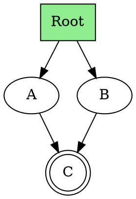

# TerraDot - Interactive DOT Graph Viewer

Ein interaktiver Webservice zur Darstellung und Erkundung von Graphviz DOT-Graphen.


## ✨ Features

- **Interaktive Graph-Visualisierung**: Rendern Sie DOT-Graphen mit echter Graphviz-Engine (WebAssembly)
- **Intelligentes Pfad-Highlighting**: Klicken Sie auf einen Knoten, um den Pfad zum Root hervorzuheben
  - Findet automatisch Root-Knoten (ohne eingehende Kanten)
  - Bei Graphen ohne Root: Zeigt Pfad bis zum ersten Vorgänger
  - Unterstützt zyklische Graphen und isolierte Knoten
- **Mehrere Layout-Engines**: dot, neato, fdp, circo, twopi, osage
- **Knotensuche**: Durchsuchen und filtern Sie Knoten nach Namen
- **Zoom & Pan**: Navigieren Sie durch große Graphen mit Maus-Zoom und Drag
- **Live-Vorschau**: Änderungen am DOT-Code werden sofort visualisiert
- **Beispiel-Graphen**: Vorgefertigte Beispiele zum schnellen Start

## 🚀 Schnellstart

### Voraussetzungen

- [Bun](https://bun.sh/) >= 1.0

### Installation

```bash
# Dependencies installieren
bun install

# Development-Server starten
bun dev

# Production-Build erstellen
bun run build

# Production-Build lokal testen
bun preview
```

Der Dev-Server läuft unter `http://localhost:5173/`

## 🎯 Verwendung

1. **DOT-Code eingeben**: Geben Sie Ihre DOT-Graph-Syntax im linken Editor-Panel ein
2. **Graph visualisieren**: Der Graph wird automatisch gerendert
3. **Layout wählen**: Wählen Sie verschiedene Graphviz-Layout-Engines aus (hierarchisch, force-directed, etc.)
4. **Knoten anklicken**: Klicken Sie auf einen Knoten, um den Pfad zum Root-Knoten hervorzuheben
5. **Suchen**: Verwenden Sie die Suchleiste, um spezifische Knoten zu finden

### Beispiel DOT-Syntax



## 🏗️ Projektstruktur

```
terradot/
├── src/
│   ├── components/
│   │   ├── GraphViewer.tsx        # Haupt-Graph-Rendering-Komponente
│   │   ├── DotInputEditor.tsx     # DOT-Syntax-Editor
│   │   └── GraphControls.tsx      # Steuerung (Suche, Layout)
│   ├── utils/
│   │   ├── graphParser.ts         # DOT-Parsing & Pfad-Algorithmen
│   │   └── examples.ts            # Beispiel-Graphen
│   ├── types/
│   │   └── graph.types.ts         # TypeScript-Typen
│   └── App.tsx                    # Haupt-App-Komponente
├── package.json
└── README.md
```

## 🛠️ Technologie-Stack

- **Framework**: [React](https://react.dev/) 19 mit TypeScript
- **Build-Tool**: [Vite](https://vitejs.dev/)
- **Paketmanager**: [Bun](https://bun.sh/)
- **Graph-Rendering**: [d3-graphviz](https://github.com/magjac/d3-graphviz) (Graphviz via WebAssembly)
- **Styling**: [Tailwind CSS](https://tailwindcss.com/) 3
- **Graphviz-Engine**: [@hpcc-js/wasm](https://github.com/hpcc-systems/hpcc-js-wasm)

## 🧩 Kern-Algorithmen

### Root-Knoten-Erkennung

Findet alle Knoten ohne eingehende Kanten:

```typescript
function findRootNodes(graphData: GraphData): string[] {
  const nodesWithIncoming = new Set<string>();
  graphData.edges.forEach(edge => nodesWithIncoming.add(edge.to));
  
  return Array.from(graphData.nodes.keys())
    .filter(nodeId => !nodesWithIncoming.has(nodeId));
}
```

### Pfadsuche (BFS)

Findet den kürzesten Pfad von einem Knoten zum Root:

```typescript
function findPathToRoot(nodeId: string, graphData: GraphData): string[] {
  const roots = findRootNodes(graphData);
  const queue: string[][] = [[nodeId]];
  const visited = new Set<string>();
  
  while (queue.length > 0) {
    const path = queue.shift()!;
    const current = path[path.length - 1];
    
    if (roots.includes(current)) return path;
    if (visited.has(current)) continue;
    
    visited.add(current);
    const parents = graphData.adjacencyList.get(current) || [];
    parents.forEach(parent => queue.push([...path, parent]));
  }
  
  return [nodeId];
}
```

## 📝 Lizenz

MIT

## 🤝 Beiträge

Beiträge sind willkommen! Bitte öffnen Sie ein Issue oder Pull Request.

---

**Entwickelt mit ❤️ und Bun**
