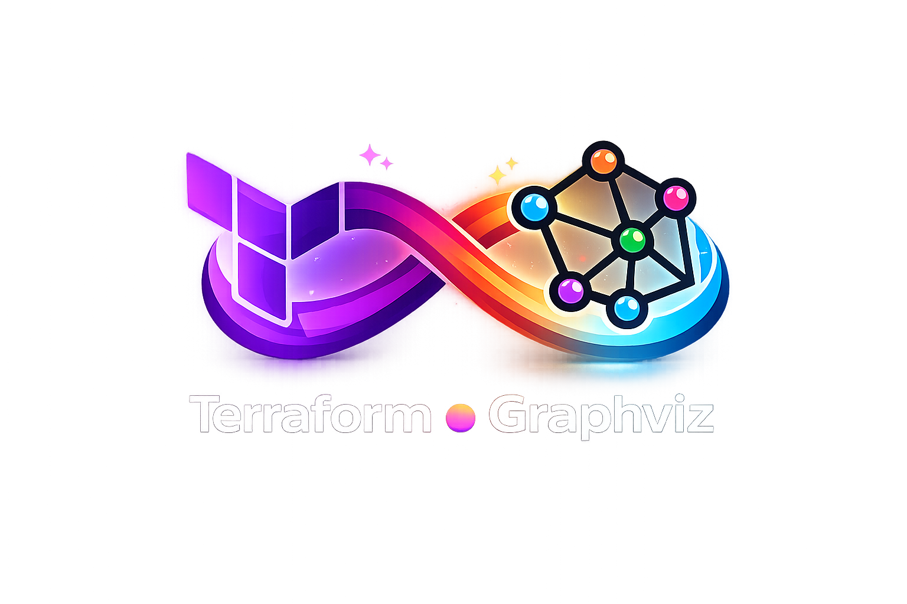
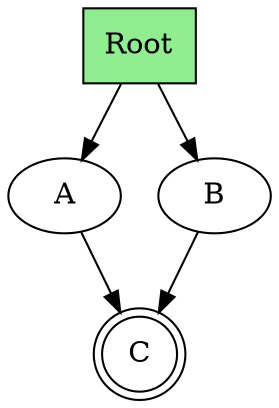

<div align="center">



# TerraDot - Interactive Terraform/OpenTofu/DOT Graph Viewer

An interactive web service for visualizing and exploring Graphviz DOT graphs.


---

</div>

## ✨ Features

- **Interactive Graph Visualization**: Render DOT graphs with real Graphviz engine (WebAssembly)
- **Bidirectional Path Highlighting**: Click on a node to highlight paths
  - **Predecessors Mode**: Shows all ancestor paths leading TO the clicked node
  - **Successors Mode**: Shows all descendant paths leading FROM the clicked node
  - Automatically finds root nodes (without incoming edges)
  - Supports cyclic graphs and isolated nodes
  - Highlights both nodes AND connecting edges in paths
- **Dark Mode**: Full dark mode support with persistent preferences
- **Multiple Layout Options**: Three directional layouts using dot engine
  - Top to Bottom (hierarchical)
  - Left to Right
  - Right to Left
- **Resizable Panels**: Adjustable split view between editor and graph viewer
- **Node Search**: Search and filter nodes by name with real-time highlighting
- **Zoom & Pan**: Navigate through large graphs with mouse zoom (0.1-50x) and drag
- **Live Preview**: Changes to DOT code are instantly visualized
- **Example Graphs**: Pre-made examples for quick start

## 🎯 Target Audience

This tool is specifically designed for **Terraform users** who work with `terraform graph` and need to debug and understand their infrastructure dependencies. It provides an interactive way to explore Terraform dependency graphs, making it easier to identify issues, understand resource relationships, and optimize your infrastructure code.

## 🚀 Quick Start

### Prerequisites

- [Bun](https://bun.sh/) >= 1.0

### Installation

```bash
# Install dependencies
bun install

# Start development server
bun dev

# Create production build
bun run build

# Test production build locally
bun preview
```

The dev server runs at `http://localhost:5173/`

## 🎯 Usage

1. **Enter DOT code**: Enter your DOT graph syntax in the left editor panel
2. **Visualize graph**: The graph will be automatically rendered
3. **Choose layout**: Select different directional layouts (Top-to-Bottom, Left-to-Right, Right-to-Left)
4. **Click nodes**: Click on a node to highlight paths
   - Use the toggle to switch between Predecessors (ancestors) and Successors (descendants)
   - View detailed path statistics in the info panel
5. **Search**: Use the search bar to find and highlight specific nodes
6. **Resize panels**: Drag the divider between editor and viewer to adjust sizes
7. **Toggle dark mode**: Click the theme toggle for comfortable viewing in any lighting

### Example DOT Syntax



## 🏗️ Project Structure

```
terradot/
├── src/
│   ├── components/
│   │   ├── GraphViewer.tsx        # Main graph rendering component (d3-graphviz)
│   │   ├── GraphControls.tsx      # Controls (search, layout, dark mode, toggle)
│   │   ├── DotInputEditor.tsx     # DOT syntax editor
│   │   └── ResizablePanels.tsx    # Resizable split-panel layout
│   ├── utils/
│   │   ├── graphParser.ts         # DOT parsing & path algorithms (BFS, ancestors, successors)
│   │   └── examples.ts            # Example graphs
│   ├── types/
│   │   └── graph.types.ts         # TypeScript types
│   ├── App.tsx                    # Main app component & state management
│   ├── main.tsx                   # App entry point
│   └── index.css                  # Tailwind + custom graph styles
├── package.json
└── README.md
```

## 🛠️ Technology Stack

- **Framework**: [React](https://react.dev/) 19 with TypeScript
- **Build Tool**: [Vite](https://vitejs.dev/)
- **Package Manager**: [Bun](https://bun.sh/)
- **Graph Rendering**: [d3-graphviz](https://github.com/magjac/d3-graphviz) (Graphviz via WebAssembly)
- **Styling**: [Tailwind CSS](https://tailwindcss.com/) 3
- **Graphviz Engine**: [@hpcc-js/wasm](https://github.com/hpcc-systems/hpcc-js-wasm)

## 📝 License

MIT

## 🤝 Contributing

Contributions are welcome! Please open an issue or pull request.

---

**Built with ❤️ and Bun**
